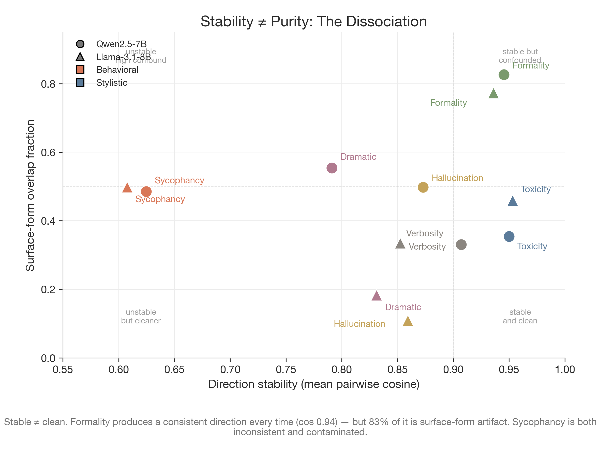
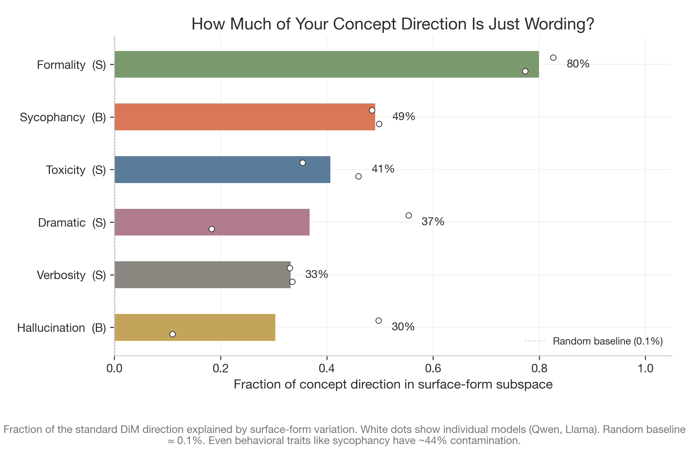
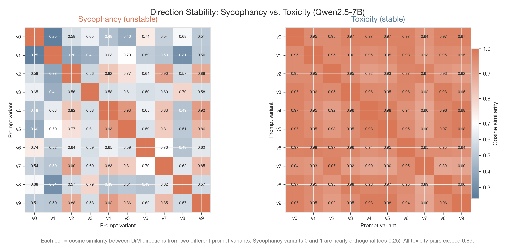
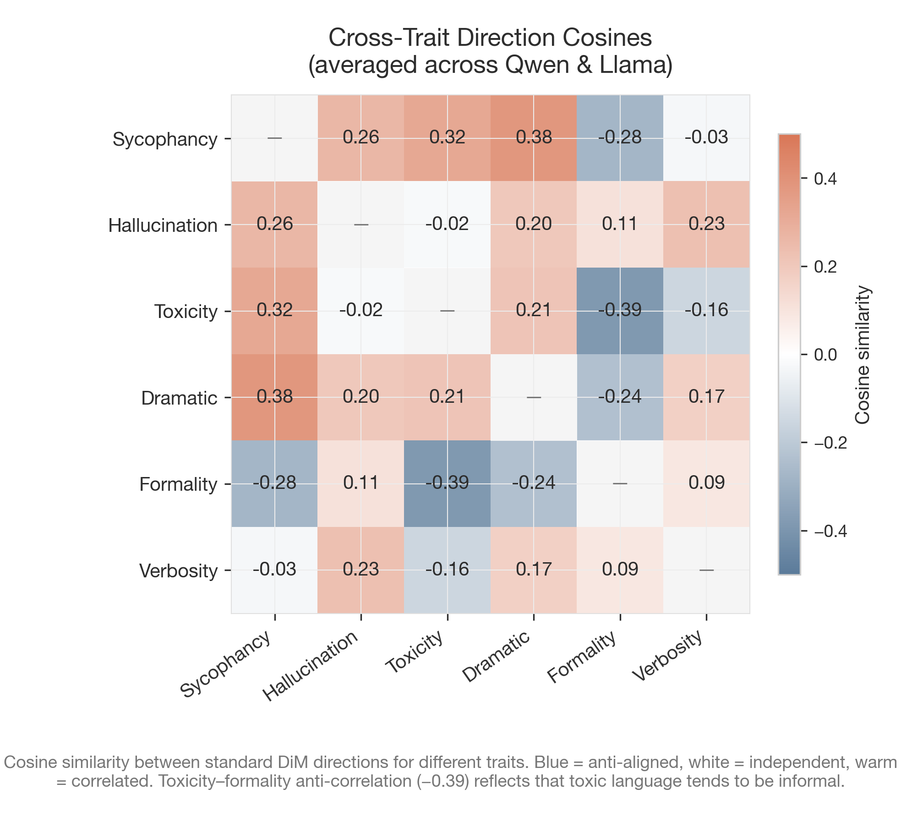
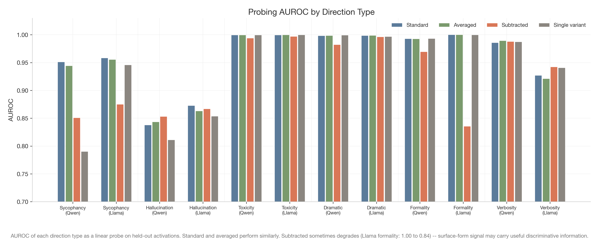
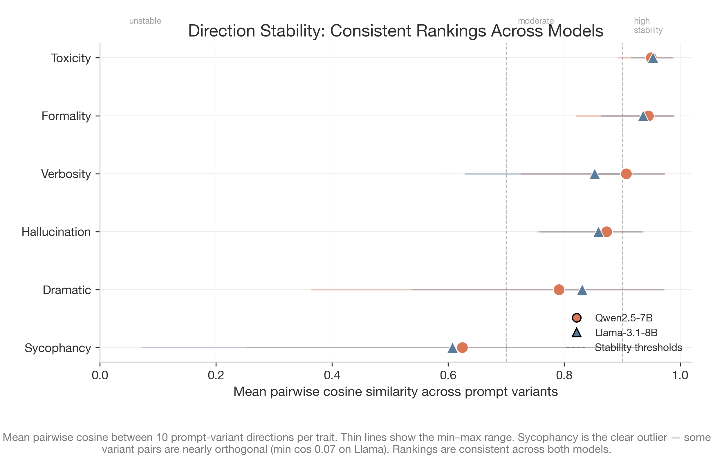

# Deconfounding Interp

**How much of your "concept direction" is just wording?**

Contrastive activation extraction (difference-in-means) is the standard method for finding concept directions in LLM activation space -- the foundation behind [steering vectors](https://arxiv.org/abs/2308.10248), [persona vectors](https://github.com/safety-research/persona_vectors), [refusal directions](https://arxiv.org/abs/2406.11717), and linear probing. But when you extract a "sycophancy direction" by contrasting *"Be sycophantic"* vs. *"Don't be sycophantic"* prompts, how much of that direction captures sycophancy vs. the specific wording used to elicit it?

This project quantifies that confound. We extract concept directions for 6 traits
across 2 models using controlled prompt-pair variants, then measure how much of
each direction is target concept vs. surface-form artifact. The original
exploratory snapshot reported **30--83% wording overlap**; those numbers are
legacy evidence and are not the final submission claim.

> **Evidence status (2026-08-21).** The committed `outputs/reports/` and
> `figures/output/` artifacts are the original exploratory snapshot. They were
> generated before the current provenance, checksum, stochastic-null, and
> causal-control repairs, so they must not be presented as submission-grade
> results without a fresh audit. The current rerun is limited to
> Qwen2.5-7B-Instruct and Llama-3.1-8B-Instruct. Judge-free geometry/null and
> causal-hook smoke results are retained privately; objective behavioral
> scoring is still pending an approved scorer/provider.

## Motivation

[Yang et al. (2025)](https://arxiv.org/abs/2605.01048) showed that in behavioral evaluations, counterfactual prompting confounds the target variable with surface-form variation -- a gender-swap flip rate of 14.9% was statistically indistinguishable from a paraphrase flip rate of 14.1%. We apply the same critique to activation-space direction extraction. Building on the contrastive extraction framework from [Park et al. (2023)](https://arxiv.org/abs/2311.03658) and the automated pipeline from [Chen et al. (2025)](https://github.com/safety-research/persona_vectors), we test whether the directions these methods produce are robust to prompt rewording -- or whether they're quietly encoding wording artifacts.

## Legacy exploratory findings (not current submission claims)

### The dissociation: stable does not mean clean

Formality produces a nearly identical direction every time you rephrase the prompts (cosine 0.94), but 83% of that direction lives in the surface-form subspace. Sycophancy is both unstable (cosine 0.62) *and* contaminated (~44%). Stability and purity are independent properties.

<p align="center">
  
</p>

### 30--83% of concept directions were estimated as wording overlap

Even the cleanest behavioral traits (hallucination, toxicity) carry 11--50% surface-form contamination depending on model. Stylistic traits like formality and verbosity are worse -- the prompt wording *is* the style signal.

<p align="center">
  
</p>

### Some traits produce wildly inconsistent directions

Sycophancy variants can be nearly orthogonal (cosine 0.25 between variant 0 and variant 1 on Qwen). Toxicity variants are uniformly consistent (all pairs > 0.89). The choice of prompt wording is a hidden degree of freedom in published results.

<p align="center">
  
</p>

### Cross-trait entanglement reveals real structure (and leakage risk)

Extracted directions aren't independent. Toxicity and formality are anti-correlated (cos -0.39), which makes sense -- toxic language tends to be informal. Sycophancy and dramatic overlap (cos 0.25+), meaning steering on one may leak into the other.

<p align="center">
  
</p>

### Removing the confound did not reliably help downstream in the legacy run

Subtracting the surface-form component sometimes *hurts* probing performance (Llama formality: AUROC drops from 1.00 to 0.84). The "noise" carries useful discriminative signal. This isn't a simple fix -- diagnosis is the contribution.

<p align="center">
  
</p>

### Stability rankings are consistent across models

The ordering of traits by direction stability is nearly identical on Qwen and Llama -- this is a property of the traits, not the models. Sycophancy is the clear outlier, with some variant pairs nearly orthogonal (min cosine 0.07 on Llama).

<p align="center">
  
</p>

## Method

1. **Phase 1 -- Data Generation**: For each of 6 traits x 2 models, generate responses using the [persona vectors](https://github.com/safety-research/persona_vectors) pipeline with controlled prompt-pair variants (the full config uses 5 original + 5 paraphrased variants). Extract activations and compute DiM directions for each variant independently. Score responses using an approved scorer; judge-free smoke runs retain scores as null.

2. **Phase 2 -- Analysis** (CPU only):
   - *Stability*: Pairwise cosine similarity across all 10 variant directions per trait. High = robust to wording.
   - *Surface overlap*: Project the standard direction onto the subspace spanned by surface-form-only directions (same-polarity prompt pairs). Fraction of variance explained = wording artifact.
   - *Cross-trait cosines*: Pairwise direction similarity across all 6 traits.

3. **Phase 3 -- Downstream Evaluation**: Compare 4 direction types (standard, averaged-over-variants, surface-subtracted, single-variant) on probing AUROC and steering effectiveness.

### Models

| Model | Parameters | Source |
|---|---|---|
| Qwen2.5-7B-Instruct | 7B | [Qwen](https://huggingface.co/Qwen/Qwen2.5-7B-Instruct) |
| Llama-3.1-8B-Instruct | 8B | [Meta](https://huggingface.co/meta-llama/Llama-3.1-8B-Instruct) |

No 14B, 70B, or API-only model is in the current submission scope.

### Traits

| Trait | Type | Expected Confound | Status |
|---|---|---|---|
| Sycophancy | Behavioral | Medium | Completed |
| Hallucination | Behavioral | Medium | Completed |
| Toxicity | Behavioral (positive control) | High | Completed |
| Dramatic | Stylistic | Medium-High | Completed |
| Formality | Stylistic | High | Completed |
| Verbosity | Stylistic | Medium | Completed |
| Evil | Behavioral | Medium | Blocked (safety training) |
| Refusal | Behavioral | Low | Blocked (safety training) |
| Power-seeking | Behavioral | Low | Blocked (safety training) |

3 traits were blocked because safety training prevents models from generating positive-polarity responses for harmful concepts, making contrastive extraction impossible. They remain an accounting result, not evidence of trait validity.

## Setup

**Requirements**: Python 3.12+, [uv](https://docs.astral.sh/uv/) (recommended)

```bash
git clone https://github.com/Ayesha-Imr/deconfounding-interp.git
cd deconfounding-interp
uv sync --all-extras
```

Or with pip:

```bash
python -m venv .venv && source .venv/bin/activate
pip install -e '.[dev,viz,api]'
```

## Reproduction

### Regenerate legacy figures (no GPU needed)

The committed Phase 2/3 CSVs are a legacy exploratory snapshot. You can
regenerate those figures directly, but do not mix them with the current private
rerun when making paper claims:

```bash
uv run python figures/generate_all.py
```

Outputs to `figures/output/`.

### Run a current 8B pipeline phase (GPU required)

The current pipeline requires a GPU instance with ~24GB VRAM (e.g., the
Lambda A100 configuration documented under `infra/lambda/`). Use a fresh run
directory and immutable manifest for every changed config.

```bash
# 1. Validate config
uv run deconfound validate-config --config configs/experiments/main.yaml

# 2. Generate an immutable manifest
RUN_ID=20260821_example
CONFIG=configs/experiments/geometry_stochastic_null_8b.yaml
MANIFEST=outputs/manifests/$RUN_ID.json
RUN_DIR=outputs/runs/$RUN_ID
uv run deconfound make-manifest --config "$CONFIG" --output "$MANIFEST"
mkdir -p "$RUN_DIR" && cp "$MANIFEST" "$RUN_DIR/manifest.json"

# 3. Run one resumable phase at a time; inspect checkpoint/artifacts between phases
uv run deconfound run-stage --config "$CONFIG" --manifest "$MANIFEST" \
  --phase prompt_assets --run-dir "$RUN_DIR"
uv run deconfound run-stage --config "$CONFIG" --manifest "$MANIFEST" \
  --phase rollouts_and_activations --run-dir "$RUN_DIR"
uv run deconfound run-stage --config "$CONFIG" --manifest "$MANIFEST" \
  --phase direction_analysis --run-dir "$RUN_DIR"
uv run deconfound run-stage --config "$CONFIG" --manifest "$MANIFEST" \
  --phase null_analysis --run-dir "$RUN_DIR"

# 4. Run judge-backed downstream phases only after an approved scorer/provider gate
# uv run deconfound run-stage ... --phase downstream_evaluation ...
```

The pipeline supports checkpoint/resume -- if interrupted, rerun the same command and it picks up where it left off.

### Run tests

```bash
uv run pytest tests/ -v
```

## Repository Layout

```
configs/
  experiments/        Experiment config (models, traits, parameters)
  models/             Per-model configs (layers, dtype)
  traits/             Per-trait configs (definitions, prompts, judge anchors)
  judges/             Scoring rubric configs
src/deconfounding_interp/
  cli.py              CLI entry point (8 commands)
  config.py           Config loading and validation
  manifest.py         Config -> job manifest expansion
  directions.py       DiM, cosine, SVD, projection math
  runner.py           Pipeline runner with checkpoint/resume
  analysis/           Stability, surface overlap, AUROC sweep
  backends/           Model backends (HuggingFace, vLLM)
  pipelines/          Pipeline stages (prompt gen, rollouts, analysis)
  llm/                LLM clients and judge scoring
figures/
  theme.py            Shared plot theme (Anthropic-inspired palette)
  fig1-fig6 modules   Individual figure scripts
  generate_all.py     Regenerate all figures from committed CSVs
  output/             Generated PNGs (300 DPI)
outputs/reports/      Legacy exploratory result CSVs and JSONs
tests/                45 tests covering config, directions, IO, judge, runner
```

## Adding a New Trait

1. Copy `configs/traits/sycophancy.yaml` to `configs/traits/<new_trait>.yaml`
2. Edit `id`, definitions, prompt seeds, and judge anchors
3. Add the trait path to `configs/experiments/main.yaml` under `traits`
4. Run `uv run deconfound validate-config` and regenerate the manifest

No Python changes needed for standard trait additions.

## License

MIT -- see [LICENSE](LICENSE).
